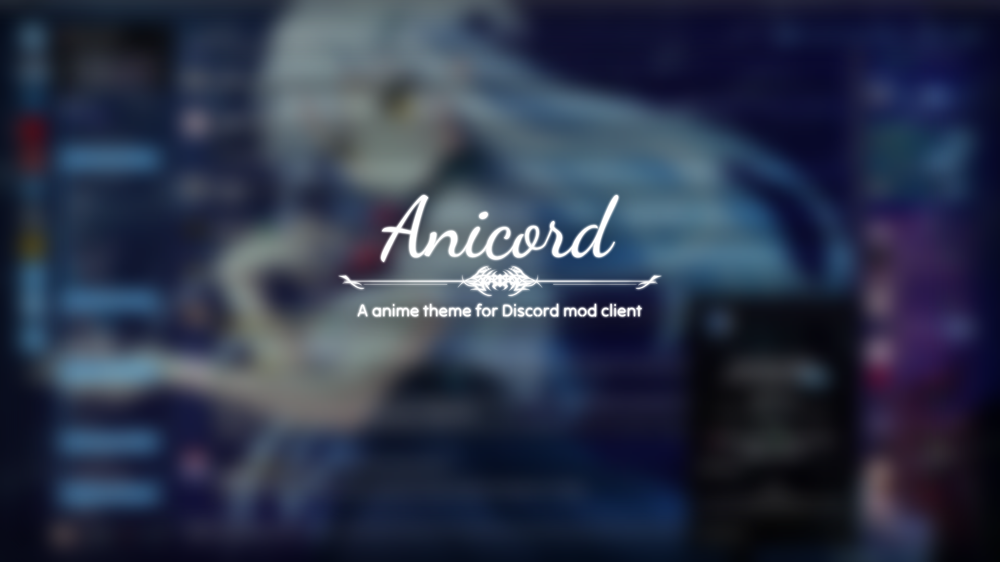
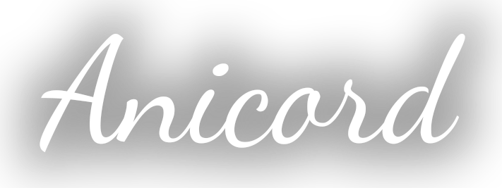
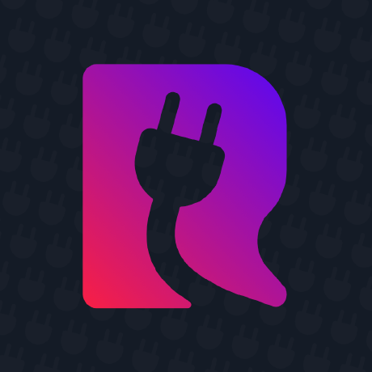
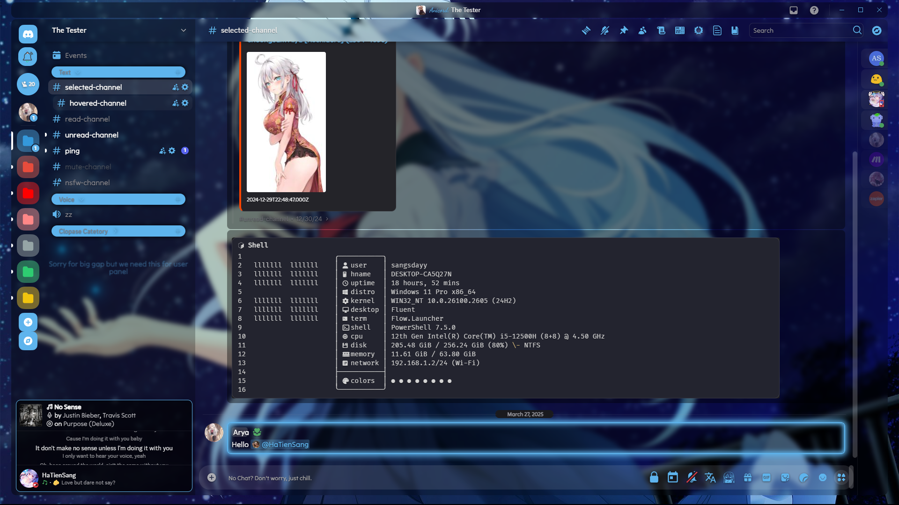
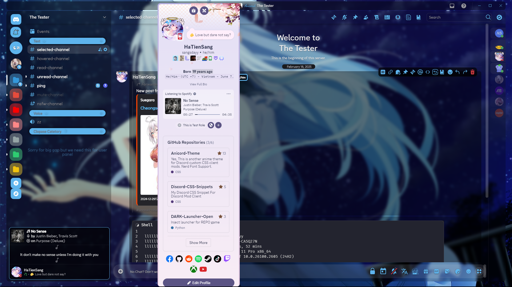
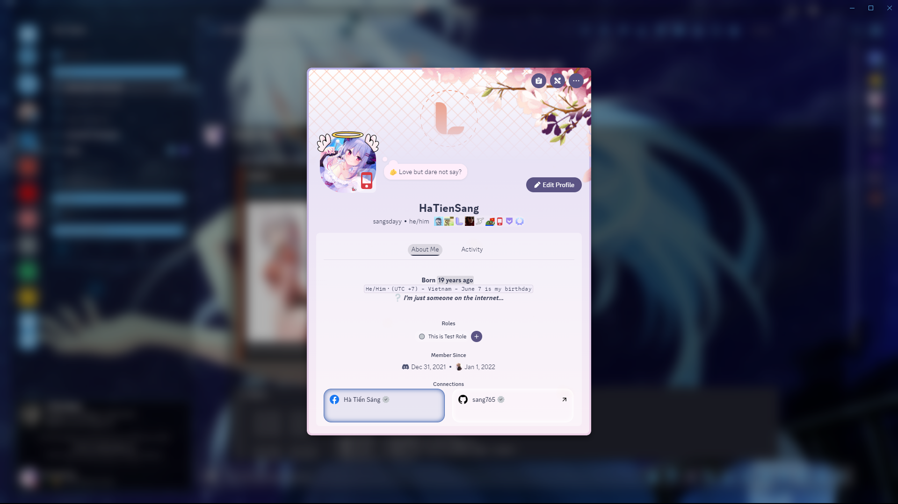
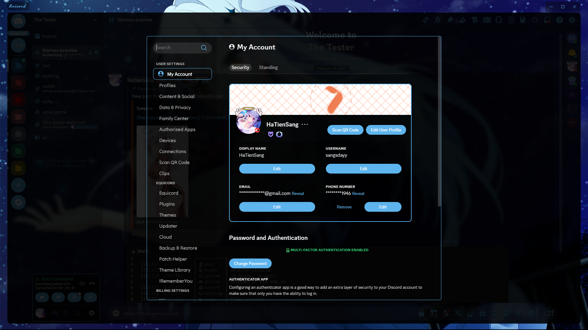

<!-- HEAD PAGE -->
<div align="center">
  
  <br>
  <a href="https://github.com/sang765/Anicord-Theme"></a>
  <h3>A <strong>anime</strong> theme for Discord mod client.</h3>
  <a href="https://betterdiscord.app"></a>
  <a href="https://replugged.dev/"></a>
  <a href="https://vencord.dev"></a>
  <a href="https://openasar.dev/"></a>
  <a href="https://github.com/aero-mod/aero"></a>
</p>
<h6>This theme is a remake of the <strong>Translucent</strong> theme but I have added a little CSS from <strong>Chillax, ClearVersion</strong> theme, Vencord, BetterDiscord server and a little of my own CSS. All CSS sources I have used will be credited at the end of the reading file.</h6>
</div>

<p align="center">
  <a href="https://github.com/sang765/Anicord-Theme" style="pointer-events: none; cursor: default;">
    
    
	<br>
	<a href="https://github.com/sang765/Anicord-Theme/commits/main/"></a>
  </a>
</p>

<!-- BODY -->

##  New Features:

- Nerd Font Support, Now you can use Nerd Font Icon with others custom font.


## 🖼️ Screenshots: (Old "Update soon")
>[!NOTE]
> This screenshot was taken with ***148 Vencord plugins enabled*** so there will be some things that are different in the screenshot. Hope you understand (I'm too lazy to turn it off)

Main Screen:
<br>

<br>
Member Server Preview:
<br>

<br>
User Profile Preview:
<br>

<br>
Settings Preview:
<br>

<br>
Some GIF Preview:
<br>
<div align="center">

<br>

<br>

</div>
<br>
Transparency Background Support With Transparency Option:
<br>
<div align="center">

</div>
<br>


## ⚙️ Install Theme
### Online Import (Vencord)

```
https://sang765.github.io/Anicord-Theme/themes/Anicord.css
```

### Quick CSS Import

```css
/* Theme Import */
@import url('https://sang765.github.io/Anicord-Theme/themes/Anicord.css');
/* CSS You Can Custom */
:root {
	--app-bg: url('https://sang765.github.io/Anicord-Theme/assets/themeimage.png'); /* background */
	/* 📄 NOTE: If you want the background to be transparent then you can remove the `url(imageurl)` and then change the attribute to `transparent`
           Requirements: Please enable "Windows Transparent" in your client mod make sure that work. You aslo can use Mica For Everyone to have a transparent backgound with Mica blur effect */
	--app-blur: 5px;
	--app-margin: 24px;
	--app-radius: 10px; /*	-	*/
	--main-font: 'Tilt Neon';
	--code-font: '';
	--accent-hue: 204; /*	Main Color	*/
	--accent-saturation: 80%;
	--accent-lightness: 65%;
	--accent-opacity: 1;
	--accent-text-color: #fff; /*	-	*/
	--sidebar-color: rgba(0,0,0,0.4);
	--main-content-color: rgba(0,0,0,0.2); /*	-	*/
	--message-color: rgba(0,0,0,0.4);
	--message-radius: 8px;
	--message-padding-top: 8px;
	--message-padding-side: 8px; /*	-	*/
	--reply-hue: 226;
	--reply-saturation: 77.4%;
	--reply-lightness: 61.8%;
	--reply-opacity: 1; /*	-	*/ 
	--textarea-color: 255,255,255;
	--textarea-alpha: 0.1;
	--textarea-alpha-focus: 0.15;
	--textarea-text-color: #fff;
	--textarea-radius: 22px;  /*	-	*/
	--card-color: rgba(0,0,0,0.4);
	--card-color-hover: rgba(0,0,0,0.5);
	--card-color-select: rgba(0,0,0,0.7); /*	-	*/	
	--button-height: 32px;
	--button-padding: 0 16px;
	--button-action-color: #000;
	--button-radius: 16px; /*	-	*/
	--interactive-normal: #aaa;
	--interactive-hover: #ddd;
	--interactive-active: #fff;
	--interactive-muted: #777; /*	-	*/
	--background-modifier-hover: rgba(255,255,255,0.075);
	--background-modifier-selected: rgba(255,255,255,0.125);
	  /* SETTING MODAL */
  	--settingsinline-size: 960;
  	--settingsblock-size: 80;
  	--settingsbackground: transparent;
}
```

### Download Theme
- Goto [release](https://github.com/sang765/Anicord-Theme/releases) page.
- Download **Anicord.theme.css**
- Open your theme folder and put file **Anicord.theme.css** to theme folder
- Enable it and enjoy.

## 🌟 Star History

<a href="https://star-history.com/#sang765/Anicord-Theme&Date">
 <picture>
   <source media="(prefers-color-scheme: dark)" srcset="https://api.star-history.com/svg?repos=sang765/Anicord-Theme&type=Date&theme=dark" />
   <source media="(prefers-color-scheme: light)" srcset="https://api.star-history.com/svg?repos=sang765/Anicord-Theme&type=Date" />
   
 </picture>
</a>

## 🖋️ CREDITS:
- **[Translucence Theme](https://betterdiscord.app/theme/Translucence)**

<a href="https://betterdiscord.app/theme/Translucence"></a>

- **[Chillax Theme](https://betterdiscord.app/theme/Chillax)**

<a href="https://betterdiscord.app/theme/Chillax"></a>

- **[ClearVision V6](https://betterdiscord.app/theme/ClearVision)**

<a href="https://betterdiscord.app/theme/ClearVision"></a>

- CSS Snippet from **[Better Discord Server](https://discord.gg/0Tmfo5ZbORCRqbAd)** and **[Vencord Discord Server](https://discord.gg/vencord)**

## 👍 Contributors
- Thank for all your suppot 😉


