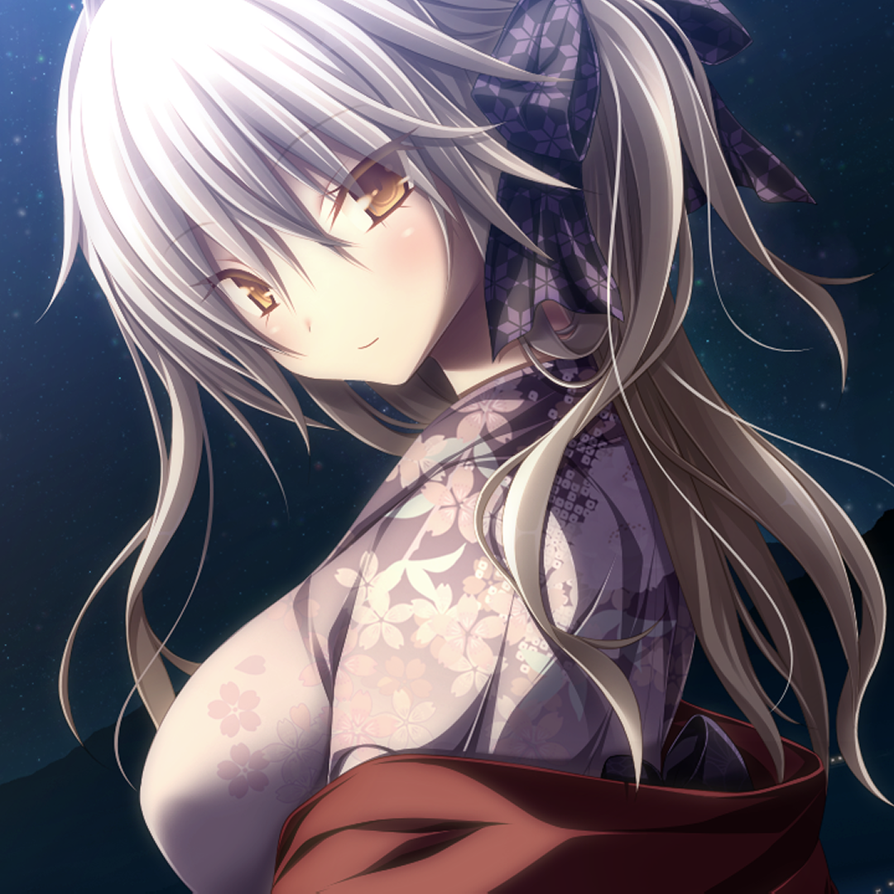

<!-- HEAD PAGE -->
<div align="center">
  
  <h1><strong>Anicord</strong></h1>
  <h3>A <strong>anime</strong> theme for Discord mod client.</h3>
  <h6>This theme is a remake of the <strong>Translucent</strong> theme but I have added a little CSS from <strong>Chillax</strong> theme, Vencord, BetterDiscord server and a little of my own CSS. All CSS sources I have used will be credited at the end of the reading file.</h6>
</div>

<p align="center">
  <a href="https://github.com/sang765/AniCord-Theme" style="pointer-events: none; cursor: default;">
    
    
  </a>
</p>

<!-- BODY -->

## 🖼️ Screenshots:
>[!WARNING]
> The background has been replaced so when the theme is turned on, it will have a completely different background than the original.

Main Screen:


Member Server Preview:


User Profile Preview:


Settings Preview:


## ⚙️ Install Theme
### Online Import (Vencord)

```
https://raw.githubusercontent.com/sang765/AniCord-Theme/main/source.css
```

### Quick CSS Import

```css
@import url("https://raw.githubusercontent.com/sang765/AniCord-Theme/main/source.css");
```

### Download Theme
- Goto [release](https://github.com/sang765/AniCord-Theme/releases) page.
- Download **Anicord.theme.css**
- Open your theme folder and put file **Anicord.theme.css** to theme folder
- Enable it and enjoy.


## 🖋️ CREDITS:
- Translucence Theme: https://betterdiscord.app/theme?id=156

<a href="https://betterdiscord.app/theme?id=156"></a>

- Chillax Theme: https://betterdiscord.app/theme?id=736

<a href="https://betterdiscord.app/theme?id=736"></a>

- CSS Snippet from [Better Discord Server](https://discord.gg/0Tmfo5ZbORCRqbAd) and [Vencord Discord Server](https://discord.gg/vencord)

