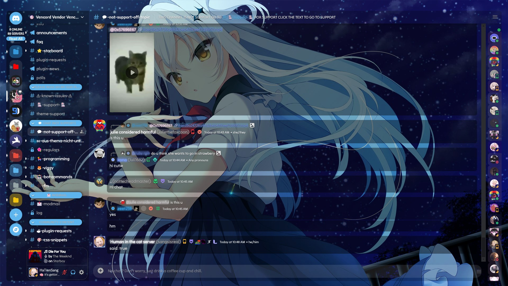
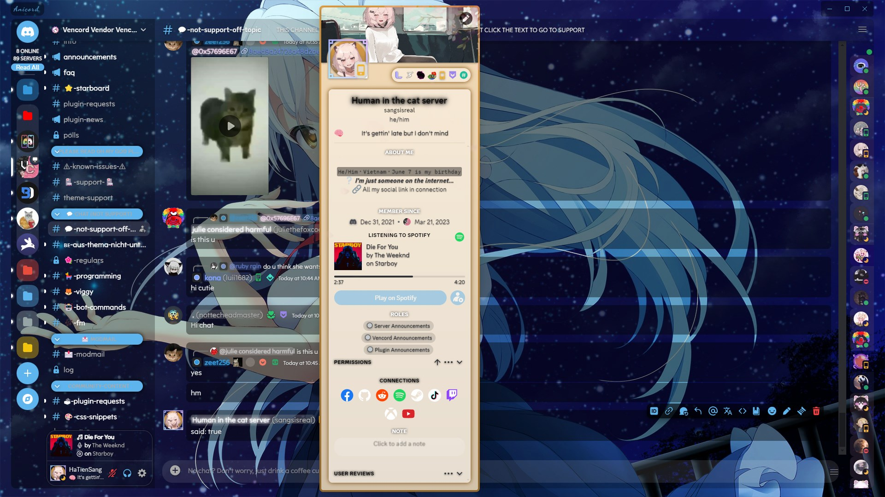
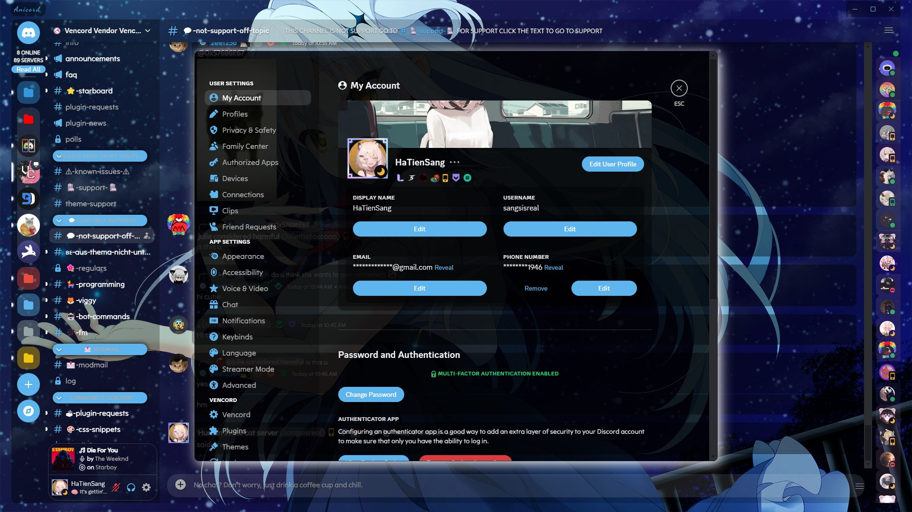

<!-- HEAD PAGE -->
<div align="center">
  

  <a href="https://github.com/sang765/Anicord-Theme"></a>
  <h3>A <strong>anime</strong> theme for Discord mod client.</h3>
  <a href="https://betterdiscord.app"></a>
  <a href="https://replugged.dev/"></a>
  <a href="https://vencord.dev"></a>
  <a href="https://openasar.dev/"></a>
  <a href="https://spikehd.github.io/projects/dorion/"></a>
</p>
<h6>This theme is a remake of the <strong>Translucent</strong> theme but I have added a little CSS from <strong>Chillax</strong> theme, Vencord, BetterDiscord server and a little of my own CSS. All CSS sources I have used will be credited at the end of the reading file.</h6>
</div>

<p align="center">
  <a href="https://github.com/sang765/Anicord-Theme" style="pointer-events: none; cursor: default;">
    
    
  </a>
</p>

<!-- BODY -->

## ⚠️ Before use the theme:
>[!WARNING]
> If you experience crashes while using the theme (Yes, I do) then I recommend you use **[Vesktop](https://github.com/Vencord/Vesktop)** because it is well optimized and crashes are rare (unless you use devtools for too long).

## 🖼️ Screenshots:
>[!NOTE]
> This screenshot was taken with ***148 Vencord plugins enabled*** so there will be some things that are different in the screenshot. Hope you understand (I'm too lazy to turn it off)

Main Screen:



Member Server Preview:



User Profile Preview:


Settings Preview:




## ⚙️ Install Theme
### Online Import (Vencord)

```
https://raw.githubusercontent.com/sang765/Anicord-Theme/main/source.css
```

### Quick CSS Import

```css
@import url("https://raw.githubusercontent.com/sang765/Anicord-Theme/main/source.css");
```

### Download Theme
- Goto [release](https://github.com/sang765/Anicord-Theme/releases) page.
- Download **Anicord.theme.css**
- Open your theme folder and put file **Anicord.theme.css** to theme folder
- Enable it and enjoy.


## 🖋️ CREDITS:
- Translucence Theme: https://betterdiscord.app/theme?id=156

<a href="https://betterdiscord.app/theme?id=156"></a>

- Chillax Theme: https://betterdiscord.app/theme?id=736

<a href="https://betterdiscord.app/theme?id=736"></a>

- CSS Snippet from [Better Discord Server](https://discord.gg/0Tmfo5ZbORCRqbAd) and [Vencord Discord Server](https://discord.gg/vencord)

